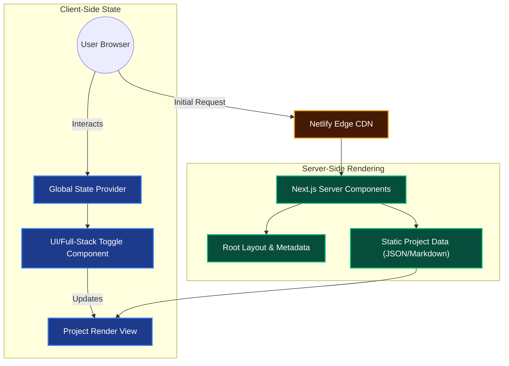

<div align="center">
  <h1>🚀 Interactive Full-Stack Developer Portfolio</h1>
  <p><strong>A high-performance, interactive portfolio showcasing advanced Front-End UI and simulated Full-Stack data architectures.</strong></p>

  <p>
    <a href="https://mmateenn.netlify.app/"></a>
    
    
  </p>
</div>

---

## 📖 Project Overview

This repository contains the source code for my professional developer portfolio. Rather than a standard static site, this portfolio is engineered as an **interactive web application**. It is designed to visually demonstrate my capabilities across the entire stack—from pixel-perfect, responsive UI design to complex, data-driven backend architectures. 

The application features unique interactive elements, including a UI/Full-Stack toggle, simulated CI/CD pipelines, and interactive database architecture sandboxes, all built on top of the modern Next.js App Router.

---

## ✨ Core Features & Technical Highlights

- 🎛️ **Interactive Persona Toggle**: A dynamic UI feature allowing recruiters to switch between my "Front-End Specialist" and "Full-Stack Engineer" personas, instantly re-rendering the relevant projects and technical focus areas.
- 🔄 **Simulated CI/CD Pipelines**: Visual representations of automated deployment pipelines, demonstrating a strong conceptual understanding of modern DevOps workflows.
- 🏗️ **Database Architecture Sandbox**: Interactive components that break down how I structure relational databases and data pipelines using PostgreSQL and Supabase.
- ⚡ **Optimized Performance**: Leverages Next.js Server Components and static site generation (SSG) to ensure lightning-fast page loads and optimal SEO scoring.
- 📱 **Pixel-Perfect Responsive Design**: Crafted with a mobile-first approach using Tailwind CSS, ensuring flawless rendering across all device breakpoints.

---

## 🛠️ Detailed Technology Stack

This project was built with a strict focus on modern web standards, utilizing the following technologies:

### Front-End & UI
* **Next.js (App Router)**: Utilized for robust routing, optimized asset delivery, and Server-Side Rendering (SSR).
* **React 18**: Leveraging modern hooks and concurrent features for smooth state management across the interactive toggles.
* **Tailwind CSS**: Used extensively for rapid, utility-first styling, custom theming, and complex CSS grid/flexbox layouts.
* **Framer Motion / CSS Animations**: Implemented for smooth page transitions and micro-interactions on the interactive sandbox components.

### Deployment & Tooling
* **Netlify**: Continuous deployment pipeline integrated directly with GitHub, utilizing Edge caching for global performance.
* **ESLint & Prettier**: Configured for strict code formatting and maintaining high code quality standards.

---

## 🏗️ System Architecture

<details>
<summary><b>View Component Architecture Diagram</b> (Click to expand)</summary>


</details>

---

## 💻 Local Development Setup

To run this portfolio locally and explore the source code, follow these steps:

### Prerequisites
- Node.js (v18.0.0 or higher)
- npm or yarn or pnpm

### Installation

1. **Clone the repository:**
   ```bash
   git clone https://github.com/meet-muhammad-mateen/portfolio.git
   cd portfolio
   ```

2. **Install dependencies:**
   ```bash
   npm install
   # or
   yarn install
   ```

3. **Start the development server:**
   ```bash
   npm run dev
   # or
   yarn dev
   ```

4. **View the application:**
   Open [http://localhost:3000](http://localhost:3000) in your browser to see the result. The page will auto-update as you edit the files.

---

## 👨‍💻 Author & Contact

**Muhammad Mateen**  
*Full-Stack & Front-End Specialist*

- 🌐 **Live Portfolio**: [mmateenn.netlify.app](https://mmateenn.netlify.app/)
- 📧 **Email**: [meetmuhammadmateen@gmail.com](mailto:meetmuhammadmateen@gmail.com)
- 💼 **LinkedIn**: [muhammadmateen112](https://www.linkedin.com/in/muhammadmateen112/)
- 📄 **Resume**: [Download / View PDF](https://drive.google.com/file/d/11zF0Cy_w5vdT0X2CqPAnWzcgnkK2ujM8/view?usp=drive_link)
